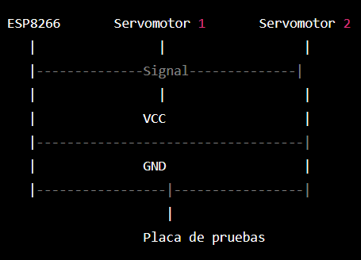

# Control remoto de servomotor con ESP8266

Este proyecto utiliza un módulo ESP8266 para controlar de forma remota dos servomotores. El módulo ESP8266 actúa como servidor web y recibe peticiones HTTP para controlar la posición de los servomotores.
Componentes

    Módulo ESP8266
    Dos servomotores
    Placa de pruebas
    Jumpers

Instalación

    Conectar los servomotores a la placa de pruebas
    Conectar el módulo ESP8266 a la placa de pruebas
    Cargar el código en el ESP8266
    Conectar el ESP8266 a la red Wi-Fi

Uso

    Conectar el ESP8266 a la red Wi-Fi
    Acceder a la dirección IP del ESP8266 desde un navegador web
    Se mostrará una página con tres botones para controlar los servomotores:
        Botón 1: Mover servomotor 1 a la posición 0 grados
        Botón 2: Mover servomotor 1 a la posición 180 grados
        Botón 3: Mover servomotor 2 a la posición 0 grados
        Botón 4: Mover servomotor 2 a la posición 180 grados

Contributing

Las contribuciones son bienvenidas. Para contribuir, por favor sigue estos pasos:

    Realiza un fork del repositorio
    Crea una rama con tu contribución (git checkout -b mi-contribución)
    Realiza tus cambios y haz commit de los mismos (git commit -am 'Agregar mi contribución')
    Sube los cambios a tu repositorio (git push origin mi-contribución)
    Crea un Pull Request desde tu rama a la rama principal del repositorio original.

Licencia

Este proyecto está bajo la licencia MIT.
